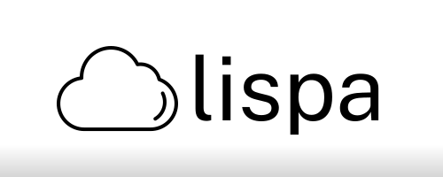

The best free APIs all in one place.

Made with
<ul>

</a>

</ul>

Tired of hitting a paywall while working with APIs? With lispa's curated list of free APIs, you won't have to worry about hitting another wall ever again!

 We know how troubling APIs can be, and that's why our goal is to make API search easy to understand and to work with as, lispa not only provide you with a description of the API you look for, but also usage examples and links to external resources related to the API.

<h2>
Table of Contents
</h2>

- [API List](#api-list)
- [Contributions](#contributions)
- [License](#license)

## API List

Without getting into detail about them, here is the list of the APIs found in lispa's API list.

(The APIs used are not own by me, but by their respective parties.)

- [Random user generator](https://randomuser.me)

- [CoinDesk (Bitcoin price index)](https://api.coindesk.com/v1/bpi/currentprice.json)
- [Cat Facts](https://catfact.ninja/)
- [The Bored API](https://www.boredapi.com/)
- [Jokes API](https://github.com/15Dkatz/official_joke_api)

## Contributions

Any type of contributions are welcome! Please read the [contribution guidelines](CONTRIBUTING.md) first before all. Also,  always remember to be respectful towards others, and act according to the [code of conduct](CODE_OF_CONDUCT.md).

## License

[Read about the license here -> 🔏](LICENSE)
